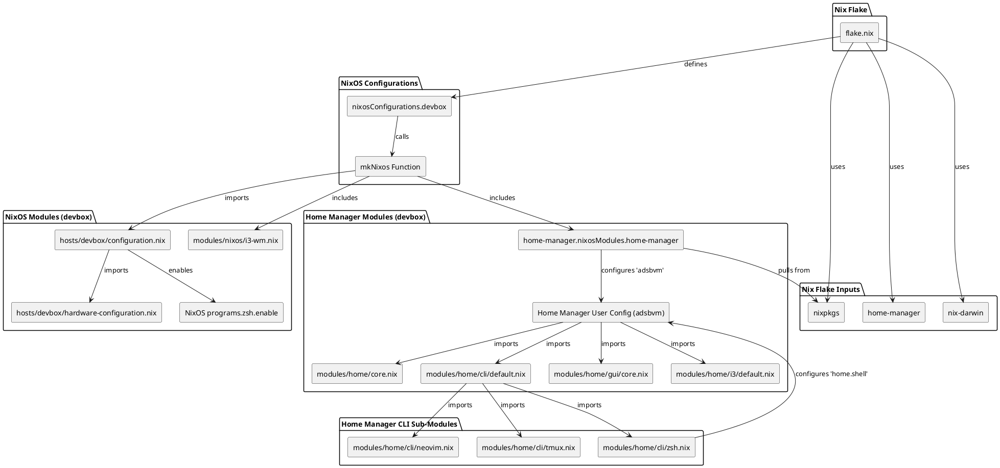

# NixOS / Home Manager Configuration Overview

This repository contains my personal NixOS and Home Manager configurations, managed as a Nix flake. This `README.md` provides an overview of the module dependencies, particularly focusing on the `devbox` host, represented as a PlantUML diagram.

## Module Dependency Tree (devbox)

The following diagram illustrates the key modules and their dependencies within the `devbox` configuration. This includes external flake inputs and the local modules composing the system.

## How to View the PlantUML Diagram

To view this diagram:

1.  **Online Viewer:** Copy the PlantUML code block above and paste it into an online PlantUML viewer (e.g., [http://www.plantuml.com/plantuml/](http://www.plantuml.com/plantuml/)).
2.  **Local Tool:** Save the code block to a file named `dependencies.puml` and use the PlantUML command-line tool or IDE plugin to render it into an image (e.g., `plantuml dependencies.puml`).
3.  **GitHub/GitLab:** These platforms often render PlantUML diagrams directly within markdown files.
